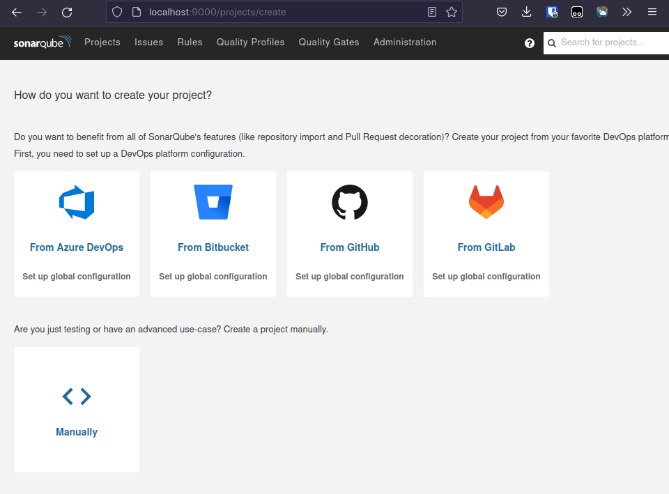
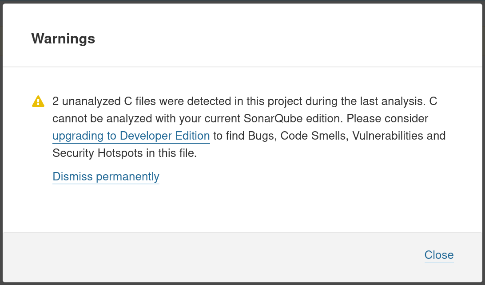

# MQTT C: Static Code Analysis with SonarQube

Victor Tarroux (IOS3 ESILV A4)

Iman TOURRES (IOS3 ESILV A4)

## Introduction

This is the report of our final project in **Securing Embedded System**, which is a course of the ESILV school given in 4th year. The goal of this project is to analyse a embeded code written in C. The project we have chosen is **MQTT-C** which is publicly available on github under MIT license ([GitHub - LiamBindle/MQTT-C: A portable MQTT C client for embedded systems and PCs alike.](https://github.com/LiamBindle/MQTT-C)). In order to analyse the c code of MQTT-C we will use SonarQube wich is an open-source platform for continuous inspection of code quality with static analysis of code to detect bugs and code smells on 29 programming languages including C.

Our objectives here are to

- Understand how MQTT-C works and how to compile it

- install SonarQube and related tools in order to analyse C code

- Metrics: complexity, duplication (blocs, files, lines), size (functions, comments, lines
  of code, statements, ...), coverage (conditions, lines, ...)

- reviewing the sonarqube report in order to identify bugs, vulnerabilities, code smells, security htospots, ...

## What is MQTT-C

[MQTT-C](https://github.com/LiamBindle/MQTT-C) is an open-source [MQTT v3.1.1](http://docs.oasis-open.org/mqtt/mqtt/v3.1.1/os/mqtt-v3.1.1-os.html) client written in C.

MQTT is a standard messaging protocol for the Internet of Things (IoT). It is designed as an extremly lightweight pulblish/subscribe messaging transport that is ideal for connecting remote devices with a small code footprint and minimal network bandwidth. MQTT today is used in a wide variety of industries, such as automotive, manufacturing, telecomunications, oil and gas, etc...

The purpose of [MQTT-C](https://github.com/LiamBindle/MQTT-C) is to provide a **portable** MQTT client for embedded systems and PC's alike. MQTT-C does this by providing a transparent Platform Abstraction Layer (PAL) wich makes porting to new platfoms easy. MQTT-C is completely thread-safe but can also run perfectly fine on single-threaded systems making MQTT-C well-suited for embedded systems and microcontrollers. Finally, MQTT-C is small; there are only two source files totalling less than 2000 lines.

The `mqtt.c` file is the main implementation of the MQTT client protocol.

The `mqtt_pal.c` provides the transparent platform layer (PAL) usefull for the protability of MQTT-C

The MQTT-C project also provide unit tests using the [cmocka unit testing framework](https://cmocka.org/).

## Setup of the code analysis environment

### Step 1: Building MQTT-C

In order to build MQTT-C, we need to install the build depedencies which are:

- **gcc** compiler (or any other c comiler)

- **git** to clone de project

- **cmocka** for unit test

- make in order to use the provided `Makefile`

For **debian**-based systems

```bash
$ apt update
$ apt install gcc cmocka make git
```

For **Arch Linux**-based systems

```bash
pacman -S gcc cmocka make git
```

Then we can clone the MQTT-C github repository

```bash
$ git clone https://github.com/LiamBindle/MQTT-C.git

Cloning into 'MQTT-C'...
remote: Enumerating objects: 2291, done.
remote: Counting objects: 100% (276/276), done.
remote: Compressing objects: 100% (165/165), done.
remote: Total 2291 (delta 134), reused 209 (delta 108), pack-reused 2015
Receiving objects: 100% (2291/2291), 1.10 MiB | 772.00 KiB/s, done.
Resolving deltas: 100% (1440/1440), done.
```

We are now able to build the project using the provided `Makefile`

```bash
$ cd MQTT-C
$ make

mkdir -p bin
gcc -Wextra -Wall -std=gnu99 -Iinclude -Wno-unused-parameter -Wno-unused-variable -Wno-duplicate-decl-specifier tests.c src/mqtt.c src/mqtt_pal.c -lcmocka  -o bin/tests
gcc -Wextra -Wall -std=gnu99 -Iinclude -Wno-unused-parameter -Wno-unused-variable -Wno-duplicate-decl-specifier examples/simple_publisher.c src/mqtt.c src/mqtt_pal.c -lpthread  -o bin/simple_publisher
gcc -Wextra -Wall -std=gnu99 -Iinclude -Wno-unused-parameter -Wno-unused-variable -Wno-duplicate-decl-specifier examples/simple_subscriber.c src/mqtt.c src/mqtt_pal.c -lpthread  -o bin/simple_subscriber
gcc -Wextra -Wall -std=gnu99 -Iinclude -Wno-unused-parameter -Wno-unused-variable -Wno-duplicate-decl-specifier examples/reconnect_subscriber.c src/mqtt.c src/mqtt_pal.c -lpthread  -o bin/reconnect_subscriber
gcc -Wextra -Wall -std=gnu99 -Iinclude -Wno-unused-parameter -Wno-unused-variable -Wno-duplicate-decl-specifier `pkg-config --cflags openssl` -D MQTT_USE_BIO examples/bio_publisher.c src/mqtt.c src/mqtt_pal.c -lpthread  `pkg-config --libs openssl` -o bin/bio_publisher
examples/bio_publisher.c: In function ‘main’:
examples/bio_publisher.c:48:5: warning: ‘ERR_load_BIO_strings’ is deprecated: Since OpenSSL 3.0 [-Wdeprecated-declarations]
   48 |     ERR_load_BIO_strings();
      |     ^~~~~~~~~~~~~~~~~~~~
In file included from /usr/include/openssl/cryptoerr.h:17,
                 from /usr/include/openssl/crypto.h:38,
                 from /usr/include/openssl/bio.h:30,
                 from include/mqtt_pal.h:100,
                 from include/mqtt.h:43,
                 from examples/bio_publisher.c:11:
/usr/include/openssl/cryptoerr_legacy.h:31:27: note: declared here
   31 | OSSL_DEPRECATEDIN_3_0 int ERR_load_BIO_strings(void);
      |                           ^~~~~~~~~~~~~~~~~~~~
gcc -Wextra -Wall -std=gnu99 -Iinclude -Wno-unused-parameter -Wno-unused-variable -Wno-duplicate-decl-specifier `pkg-config --cflags openssl` -D MQTT_USE_BIO examples/openssl_publisher.c src/mqtt.c src/mqtt_pal.c -lpthread  `pkg-config --libs openssl` -o bin/openssl_publisher
examples/openssl_publisher.c: In function ‘main’:
examples/openssl_publisher.c:50:5: warning: ‘ERR_load_BIO_strings’ is deprecated: Since OpenSSL 3.0 [-Wdeprecated-declarations]
   50 |     ERR_load_BIO_strings();
      |     ^~~~~~~~~~~~~~~~~~~~
In file included from /usr/include/openssl/cryptoerr.h:17,
                 from /usr/include/openssl/crypto.h:38,
                 from /usr/include/openssl/bio.h:30,
                 from include/mqtt_pal.h:100,
                 from include/mqtt.h:43,
                 from examples/openssl_publisher.c:10:
/usr/include/openssl/cryptoerr_legacy.h:31:27: note: declared here
   31 | OSSL_DEPRECATEDIN_3_0 int ERR_load_BIO_strings(void);
      |                           ^~~~~~~~~~~~~~~~~~~~
```

We can already see that we have few warnings during the compilation.

All the ouputs files are located in the bin folder includings unit test and example scripts

```bash
$ ls -l bin

.rwxr-xr-x 49k nami 12 Dec 15:34 bio_publisher
.rwxr-xr-x 50k nami 12 Dec 15:34 openssl_publisher
.rwxr-xr-x 49k nami 12 Dec 15:34 reconnect_subscriber
.rwxr-xr-x 49k nami 12 Dec 15:34 simple_publisher
.rwxr-xr-x 49k nami 12 Dec 15:34 simple_subscriber
.rwxr-xr-x 75k nami 12 Dec 15:34 tests
```

### Step 2: SonarQube setup

We first wanted to use our own instance of SonarQube installed locally because we wanted to avoid going through sonarcloud.io and create an account because it's always better from the point of view of personal data.

We decided to follow the instruction from the [SonarQube installation documentation](https://docs.sonarqube.org/latest/try-out-sonarqube/).

We chose to follow the docker-way because we are used to using this technology of contenerisation and it is very suitable for deploying this kind of service with a web server.

```bash
$ docker run -d --name sonarqube -e SONAR_ES_BOOTSTRAP_CHECKS_DISABLE=true -p 9000:9000 sonarqube:latest
```

SonarQube is then available at [http://localhost:9000](http://localhost:9000) and we can use the default Administrator credential:

- login: **admin**

- password: **admin**

During the first login, the system ask to change de admin password.



### Step 3: Tools to analyze C code

Now we can follow the instruction for analyzing [C/C++/Objective-C](https://docs.sonarqube.org/latest/analyzing-source-code/languages/c-family/) in the SonarQube documentation because analyzing these languages is specific in SonarQube

The first step in to install **SonarScanner** CLI, this time we can't install **SonarScanner** trought docker because it's not suitable for C, C++ or ObjectiveC projects.

> A consequence of this is that C/C++/Objective-C analysis is NOT supported by [SonarScanner CLI Docker image](https://hub.docker.com/r/sonarsource/sonar-scanner-cli)
> 
> **docs.sonarqube.org**

We can download **SonarScanner** binary for Linux 64-bit

```bash
$ wget https://binaries.sonarsource.com/Distribution/sonar-scanner-cli/sonar-scanner-cli-4.7.0.2747-linux.ziphttps://binaries.sonarsource.com/Distribution/sonar-scanner-cli/sonar-scanner-cli-4.7.0.2747-linux.zip
```

Then extract the sonar-scanner archive

```bash
$ unzip sonar-scanner-cli-4.7.0.2747-linux.zip 
```

Finally we can move Sonnar Scanner to its final destination and add it to our PATH, in our case it will be in `/opt` folder

```bash
$ sudo mv sonar-scanner-4.7.0.2747-linux /opt/sonar-scanner
$ export PATH="/opt/sonar-scanner/bin:$PATH"
```

Now we need to generate a **build configuration** so that sonarqube can correctly analyze our c code. The documentaion advises us to use **build wrapper** to generate this configuration, so we install this tool in a similar way to sonnar_scanner

```bash
$ wget sonarcloud.io/static/cpp/build-wrapper-linux-x86.zip
$ unzip build-wrapper-linux-x86.zip
$ sudo mv build-wrapper-linux-x86 /opt/build-wrapper
$ export PATH="/opt/build-wrapper:$PATH"
```

### Step 4: Analysis of our code

Let's first generate our **build configuration** using **build wrapper**. We're going to generate the configuration in a folder named `build_configuration` using `--out-dir` parameter with our `make` command

```bash
$ build-wrapper-linux-x86-64 --out-dir build_configuration make
```

This command create in particular a `build-wrapper-dump.json` file in the `build_configuration` directory. This file contain information about our build environement including system environement variables.

The next step is too create the project in the web interface of SonarQube ([http://localhost:9000](http://localhost:9000))

We choose to create **Manually** in order too use our own **sonar-scaner**. We just follow the step, nothing special here. The only important things is toot remeber our token for this project.

Now the last step before using **sonar-scaner** is too create a `sonar-project.properties` file at the root of our project and fill it with some important information for sonar-scanner

`sonar-project.properties`

```properties
sonar.projectKey=MQTT-C
sonar.projectName=MQTT-C
sonar.projectVersion=1.0
sonar.sources=src
sonar.cfamily.build-wrapper-output=build_configuration
sonar.sourceEncoding=UTF-8
sonar.host.url=http://localhost:9000
sonar.login=sqp_581fa437e403e1bf91986e8abc2ff691a8e353b9
```

Finaly we can excute **sonar-scanner**

```bash
$ sonar-scanner

...
INFO: Analysis report compressed in 11ms, zip size=14.4 kB
INFO: Analysis report uploaded in 66ms
INFO: ANALYSIS SUCCESSFUL, you can find the results at: http://localhost:9000/dashboard?id=MQTT-C
INFO: Note that you will be able to access the updated dashboard once the server has processed the submitted analysis report
INFO: More about the report processing at http://localhost:9000/api/ce/task?id=AYUMkrMfJdXf5KNT6Zs_
INFO: Analysis total time: 3.372 s
INFO: ------------------------------------------------------------------------
INFO: EXECUTION SUCCESS
INFO: ------------------------------------------------------------------------
INFO: Total time: 4.258s
INFO: Final Memory: 16M/60M
INFO: ------------------------------------------------------------------------
```

We can now consult the analysis report on the SonarQube web interface

Suprisingly, the report is empty ! By consulting the warning on the last analysis we learn that it is not possible to analyze c code with the free edition of sonarqube.



Having to pay for the developer version of sonarqube is not an option for us. We will have to find another solution.

### Step 5: Using [sonarcloud.io](https://sonarcloud.io) for C code analysis

With some research on the internet we realized that the instance of sonarqube present on [sonarcloud.io](https://sonarcloud.io) allowed us to analyze C code for free by simply registering on the website and sharing some data with them.

So let's do same as in the **Step 4** but on sonarcloud.io. We have to modify the `sonar-project.properties` file in consequence. In particular the `sonar.host.url` with `https://sonarcloud.io` and specify our new sonarcloud.io token

Finaly we have our code analysis availible publicly [here](https://sonarcloud.io/summary/overall?id=MQTT-C).


## Code analysis

### Vulnerabilities

Vulnerabilities for **mqtt.c**

| Number | Severity | Issue                                                                          | Line                               |
| ------ | -------- | ------------------------------------------------------------------------------ | ---------------------------------- |
| 1.     | Critical | The Cognitive Complexity is too high compared to the 25 allow                  | L507; L649                         |
| 2.     | Critical | Nest more than 3 [if, for, do, while, switch] statements                       | L544; L736; L736; L750; L757; L762 |
| 3.     | Critical | Remove use of ellipsis notation.                                               | L1473; L1555                       |
| 4.     | Major    | The function has a too high number of parameters compared to the 7 authorized. | L233; L1105                        |
| 5.     | Major    | Have to merge the  "if" statement with the enclosing one.                      | L531; L1691                        |
| 6.     | Major    | Useless parentheses                                                            | L1669                              |
| 7.     | Minor    | Change the type of the variable to a pointer-to-const                          | L93; L887;  L1346;  L1641          |
| 8.     | Minor    | Variable should be declared inside the loop                                    | L102; 1689                         |
| 9.     | Minor    | Reduntant cast                                                                 | L160                               |

### Remediation

#### 1. Cognitive Complexity (2 cases)

It concerned the functions ```ssize_t __mqtt_send (struct mqtt_client *client)``` and ```ssize_t __mqtt_recv (struct mqtt_client *client)```. This complexity comes from the number of ```if, else if, else, for, while, switch``` but also the number of nests. 

The issue with a high cognitive complexity is that the code will be more difficult to understand and so to maintain. If a bug or a security breach were to be discovered, it would take more time to resolve it. A solution to reduce the complexity could be to create separate functions in order to divide those functions into multiple parts.

#### 2. Nest of more than 3 statement (6 cases)

This issue is located in many parts of the code, a nest is an accumulation of statement like ```if```, here is an example of a nest of 3:

```c
if{
    //code
    if{
    //code
        if{
        //code
        }
    }
}
```

Nest like this one are difficult to read and to understand. Similarly to the first issue, the code will be harder to maintain

#### 3. Ellipsis notation (2 cases)

Issues of ellipsis notation are in the ```ssize_t mqtt_pack_subscribe_request(uint8_t *buf, size_t bufsz, unsigned int packet_id, ...)``` and ```ssize_t mqtt_pack_unsubscribe_request(uint8_t *buf, size_t bufsz, unsigned int packet_id, ...)``` functions. The ```...``` at the end means that an undefined number of arguments can be input. For example

```c
double average(int count, ...){
    //code
}

int main()
{
    // Function call
    double avg = average(6, 1, 2, 3, 4, 5, 6);
    return 0;
}
```

So average can have 2, 3, 7 or more argument. First it bypasses the compiler type checking. Also it can lead to disfunctionment of the program or even to attack.  A solution could be to replace the argument by a list of values.

#### 4. Too high number of parameters (2 cases)

According to sonarqube a maximum of 7 arguments can be used, according to the C guideline, they recommend a number of 4 arguments. This can lead to 2 issues : 

- The componenet values are no longer protected by an enforced invariant which leads to errors

- The function is probably doing more than one job violating the "one function, one responsibility rule"

The solution would be to fraction the function into 2 or more. Also, objects could be created contening those parameters.

#### 5. Unmerdge if statement (2 cases)

Two if statement could be merge and increase the code readability. For exemple

```c
x = 3;
if (x > 0){
    if(x < 10){
        printf("{} is a digit", x)
    }
}
```

Would become

```c
x = 3;
if (x >= 0 && x < 10){
    printf("{} is a digit", x)
}
```

#### 6. Useless parantheses (1 case)

This issue is in this line: 

```c
memmove(mqtt_mq_get(mq, new_tail_idx), mq->queue_tail, sizeof(struct mqtt_queued_message) * (size_t) ((new_tail_idx + 1

)));
```

The ```((new_tail_idx + 1)));``` should be written ```(new_tail_idx + 1));``` in order to avoid any miscomprehension of the code.

#### 7. Type of the variable (4 cases)

For exemple the ```struct mqtt_queued_message *curr``` should be declared like this ```const struct mqtt_queued_message *curr```.  It allows to protect the object pointed and avoid any non-intented usage. It gives a better security to the program.

#### 8. Variable should be declared inside the loop (2 cases)

The variable should be declared inside the loop, for exemple in 

```c
struct mqtt_queued_message *curr;
//code

for(curr = mqtt_mq_get(&(client->mq), 0); curr >= client->mq.queue_tail; --curr) {
// code
}
```

the code should be written like :

```c
for(struct mqtt_queud_message *curr = mqtt_mq_get(&(client->mq), 0); curr >= client->mq.queue_tail; --curr) {
// code
}
```

It is a better way to write the code for 3 different reasons:

- A better readability

- The variable can't be accidentally reused outside of the loop

- Resources are not retained longer than necessary

#### 9. Reduntant cast (1 case)

Reductant cast make the code harder to read and understant. The declaration : 

```c
void* dest = (unsigned char*)client->recv_buffer.mem_start;
```

Should be changed by

```c
void* dest = client->recv_buffer.mem_start;
```

## Conclusion

Overall, the code has a good quality. The main issue is the readability of the code. However, considering that this is an embedded software, the size of code matters. Making the code as small as possible is a good idea. But, the code can be very hard to understand for other people. Maintaining it becomes difficult and it could have an impact on the development of the code. But it could also have an impact in the correction of errors and security breaches. 

Sonarqube is a great tool which, despite the fact that it was complicated to use, allow developers to increase the quality of their code at different level (security, readibility, ...). It is very important to have tools like this one considering that the cost of resolving a bug increase during any project development. It could rise up, to a multiplication by 100 of the cost during the production phase.

The 13 of December ChatGPT was released by OpenAI. It is an artificial intelligence which aims to mimic a human to human conversation. ChatGPT has prover itself to be very useful for developers. In fact, we can ask it to create an entire web application. Moreover, this AI can also find bugs and security breach in code. This kind of advancement could make obsolete tools like sonarqube. Even in the reliability aspect of the code considering that we can ask to ChatGPT to explain to us entire page of code. But the reliability of ChatGPT isn't perfect and website like stackoverflaw banned ChatGPT answer.
